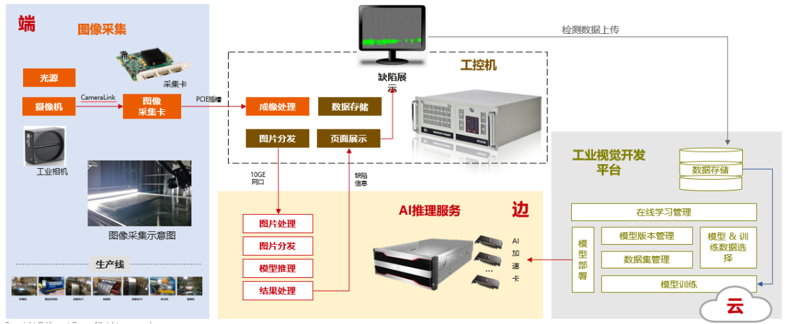
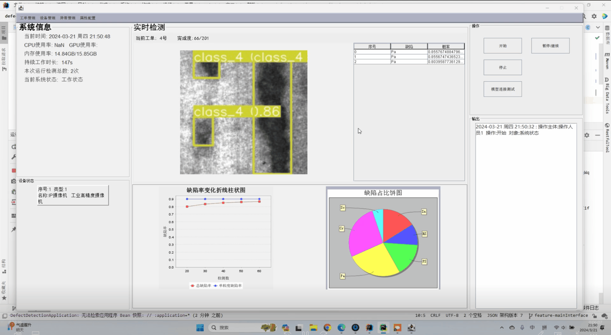
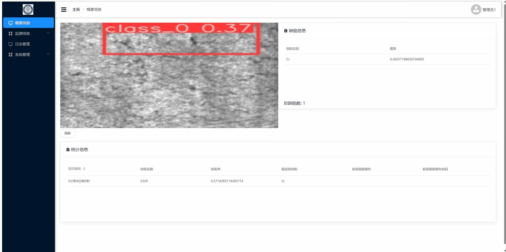
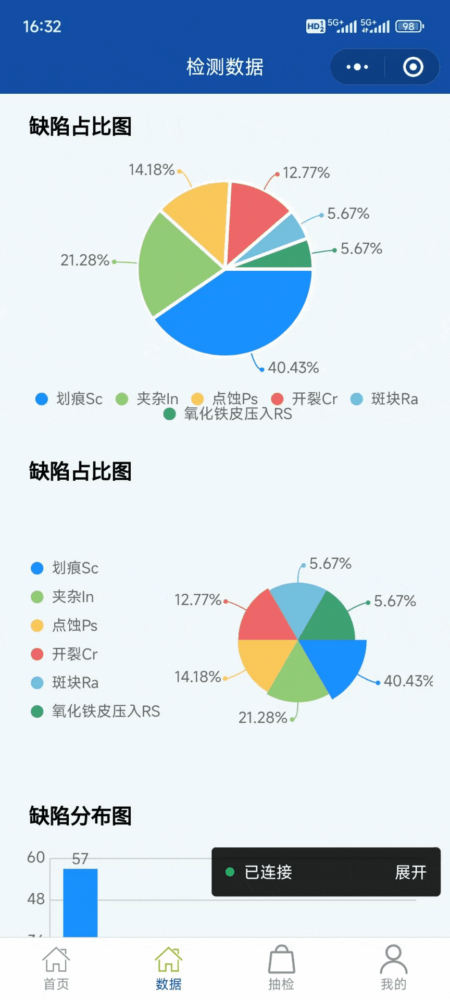

# 智检控-精密元件智能监测系统


本项目基于国产深度学习框架和先进的目标检测算法，开发了一款精密元件质量智能监测系统，解决了传统人工检测和机器学习检测所出现的问题。

本项目采用“**一机多端**”架构（工控机、展示前端、处理后端、模型预测端），**多平台**（JAVA前端、Web端、小程序端），**多功能**（智能监测、报表分析、数据展示、溯源报警），**全配套**（工控机、可视化大屏、移动小程序），提高了操作人员和管理人员的工作效率。

本项目已取得：
- 2024年中国大学生计算机设计大赛江西省赛三等奖；
- 2024海峡两岸暨港澳地区大学生计算创新作品赛三等奖；
- 中国高校计算机大赛-网络技术挑战赛选拔赛三等奖；
- 软件著作权。














# 操作手册

## 一、基本环境要求

操作系统： windows 10、windows 11

数据库： mysql 8.0

java版本： openJDK-17.0.1

maven版本：3.6.3

node.js 版本： v18.17.1

npm 版本：9.6.7

## 二、数据库环境部署

1. 打开“sql”文件夹
2. 以具有管理员权限的用户登入mysql
3. 在MySQL环境下，按顺序分别执行“建表语句sql”、“测试数据sql”

## 三、后端部署

1. 进入“defectDetection” 文件夹
3. 用idea 打开
4. 进入“defectDetection/src/main/resources/application.yaml”文件，将`username`和`password`后的内容分别修改为对于数据库的登入账号名和密码，需要在冒号后空一格。
5. 运行主类“**defectDetection/src/main/java/com/ggbond/defectdetection/DefectDetectionApplication.java**”即可打开主界面


## 四、前端部署

1. 进入idea的终端，输入` cd web/detection`，回车
2. 输入`npm install`，回车，等待模块安装
3. 确保后端已经在运行中，随后在终端输入`npm run serve`
4. 在弹出的浏览器界面即为前端界面，如果没有主动弹出，打开浏览器输入地址`http://localhost:8080/`也可以打开前端界面


## 五、模型端部署

1. 创建anaconda虚拟环境

```
conda create -n yolo python=3.8
```

2. 激活环境

```
conda activate yolo
```

3. 安装ultralytics

```
pip install ultralytics
```

4. 安装flask

```
pip install flask
```

5. 运行检测代码中的main.py


## 六、模型与后端互联

1. 确保模型端和后端机在同一局域网下
2. 获取模型端的ipv4地址
3. 打开后端文件夹，进入“defectDetection\src\main\resources\config.json”文件
4. 将model->ip对应的值修改为模型端的ipv4地址
5. 运行后端和模型端，点击后端软件界面的测试连接按钮，弹窗显示连接成功即可开始检测
